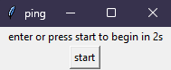

# Python / Selenium Typing Bot

> If it makes you feel better, I typed so fast that they're now making me do an anti-cheat.

\- Technoblade

## about

types fast when you tell it to, automatically, because ur bad

## how it works

opens website of choice by input using tkinter entry and uses tkinter button to start typing without restarting\
 

then, respective operations are performed on the parent element containing the text, depending on the site to maximise effectiveness (selenium is used to get the element)

speed can be adjusted by changing value of `typeInterval`

unique delays are added to special characters like `!@#$%^&*()` etc, to make the typing look more organic

## demonstrations

### TypeRacer

### monkeytype

---

### currently supported sites

- TypeRacer
  - flags anti-cheat at high wpm
- monkeytype
  - infinite wpm

### modules / libraries in use

- selenium webdriver
- pyautogui
- time
- tkinter

### upcoming features

- [ ] use async to set status (running/stopped/waiting) while typing shown in tkinter window
- [ ] use async to prevent typing from stopping while fetching words (for >100 words setting in monkeytype)
- [ ] use randomiser to add randomness to typing delay to make typing more organic

### known issues

- [ ] continues typing after timer on timed setting (monkeytype) since words are already stored; to stop, move mouse to top left/right corner of screen to trigger pyautogui failsafe or just wait
- [ ] single additional space after ending (monkeytype)

---

## changelogs

#### version 1.1 - 17/11/2022

- replaced web_typing_bot.py with correct file
- added assets to README.md

#### version 1.0 - 16/11/2022

- initial commit
